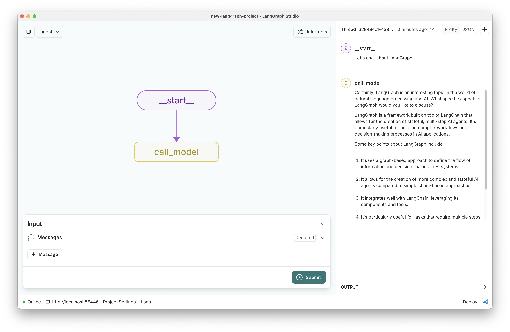

# New LangGraph Project

[](https://github.com/langchain-ai/langgraph)
[](https://github.com/langchain-ai/new-langgraph-project/actions/workflows/integration-tests.yml)
[![Open in - LangGraph Studio](https://img.shields.io/badge/Open_in-LangGraph_Studio-00324d.svg?logo=data:image/svg%2bxml;base64,PHN2ZyB4bWxucz0iaHR0cDovL3d3dy53My5vcmcvMjAwMC9zdmciIHdpZHRoPSI4NS4zMzMiIGhlaWdodD0iODUuMzMzIiB2ZXJzaW9uPSIxLjAiIHZpZXdCb3g9IjAgMCA2NCA2NCI+PHBhdGggZD0iTTEzIDcuOGMtNi4zIDMuMS03LjEgNi4zLTYuOCAyNS43LjQgMjQuNi4zIDI0LjUgMjUuOSAyNC41QzU3LjUgNTggNTggNTcuNSA1OCAzMi4zIDU4IDcuMyA1Ni43IDYgMzIgNmMtMTIuOCAwLTE2LjEuMy0xOSAxLjhtMzcuNiAxNi42YzIuOCAyLjggMy40IDQuMiAzLjQgNy42cy0uNiA0LjgtMy40IDcuNkw0Ny4yIDQzSDE2LjhsLTMuNC0zLjRjLTQuOC00LjgtNC44LTEwLjQgMC0xNS4ybDMuNC0zLjRoMzAuNHoiLz48cGF0aCBkPSJNMTguOSAyNS42Yy0xLjEgMS4zLTEgMS43LjQgMi41LjkuNiAxLjcgMS44IDEuNyAyLjcgMCAxIC43IDIuOCAxLjYgNC4xIDEuNCAxLjkgMS40IDIuNS4zIDMuMi0xIC42LS42LjkgMS40LjkgMS41IDAgMi43LS41IDIuNy0xIDAtLjYgMS4xLS44IDIuNi0uNGwyLjYuNy0xLjgtMi45Yy01LjktOS4zLTkuNC0xMi4zLTExLjUtOS44TTM5IDI2YzAgMS4xLS45IDIuNS0yIDMuMi0yLjQgMS41LTIuNiAzLjQtLjUgNC4yLjguMyAyIDEuNyAyLjUgMy4xLjYgMS41IDEuNCAyLjMgMiAyIDEuNS0uOSAxLjItMy41LS40LTMuNS0yLjEgMC0yLjgtMi44LS44LTMuMyAxLjYtLjQgMS42LS41IDAtLjYtMS4xLS4xLTEuNS0uNi0xLjItMS42LjctMS43IDMuMy0yLjEgMy41LS41LjEuNS4yIDEuNi4zIDIuMiAwIC43LjkgMS40IDEuOSAxLjYgMi4xLjQgMi4zLTIuMy4yLTMuMi0uOC0uMy0yLTEuNy0yLjUtMy4xLTEuMS0zLTMtMy4zLTMtLjUiLz48L3N2Zz4=)](https://langgraph-studio.vercel.app/templates/open?githubUrl=https://github.com/langchain-ai/new-langgraph-project)

## 6 个业务图

本项目通过 langgraph-api 标准化协议（`langgraph dev` 模式）暴露 6 个业务图：

| Graph ID | 类型 | 用途 |
|---|---|---|
| `basic-qa` | 业务图节点流 | 基础问答 |
| `intelligent-analysis` | 业务图节点流 | 智能分析 |
| `data-analysis` | 业务图节点流 | 数据分析 |
| `intelligent-report` | DeepAgents | 智能报告 |
| `deep-research` | DeepAgents | 深度研究 |
| `intelligent-tracing` | DeepAgents | 智能污染溯源 |

## 本地启动（langgraph-api 标准化模式）

```bash
# 一键启动 langgraph-api (2024) + 静态前端 (8125)
./run-local.sh

# 浏览器访问
open http://localhost:8125
```

前置条件：
- `.env` 存在（`cp .env.example .env` 后填入真实配置）
- 依赖已同步：`uv sync --all-extras`（pyproject.toml + uv.lock 为依赖真相源）

停止：
```bash
./stop-local.sh
```

`run-local.sh` 在后台启动两个进程：
- `langgraph dev --config ./langgraph.json --no-browser --port 2024` —— 平台层
- `scripts/serve_static.py --port 8125` —— 静态前端 + CORS

`run.sh`（旧自建 FastAPI）已废弃。

## Chainlit 多图聊天 UI

无需写前端, 通过按钮在 6 个图之间切换的纯 Python 聊天界面:

```bash
# 依赖已含 chainlit(ui extra), 直接启动
.venv/bin/chainlit run chainlit_app.py --port 8000
```

浏览器打开 http://localhost:8000, 点击顶部消息里的按钮即可切换图(切换后开启新会话)。
后端地址默认 `http://localhost:2024`, 可用环境变量 `LANGGRAPH_API_URL` 覆盖。

## 端到端冒烟

```bash
# 启动后:
curl -s -X POST http://localhost:2024/assistants/search \
  -H "Content-Type: application/json" -d '{}' \
  | python3 -c "import json,sys; print(len(json.load(sys.stdin)), 'assistants')"
# 应输出: 6 assistants
```

This template demonstrates a simple chatbot implemented using [LangGraph](https://github.com/langchain-ai/langgraph), designed for [LangGraph Studio](https://github.com/langchain-ai/langgraph-studio). The chatbot maintains persistent chat memory, allowing for coherent conversations across multiple interactions.



The core logic, defined in `src/agent/graph.py`, showcases a straightforward chatbot that responds to user queries while maintaining context from previous messages.

## What it does

The simple chatbot:

1. Takes a user **message** as input
2. Maintains a history of the conversation
3. Generates a response based on the current message and conversation history
4. Updates the conversation history with the new interaction

This template provides a foundation that can be easily customized and extended to create more complex conversational agents.

## Getting Started

Assuming you have already [installed LangGraph Studio](https://github.com/langchain-ai/langgraph-studio?tab=readme-ov-file#download), to set up:

1. Create a `.env` file.

```bash
cp .env.example .env
```

2. Define required API keys in your `.env` file.

<!--
Setup instruction auto-generated by `langgraph template lock`. DO NOT EDIT MANUALLY.
-->


<!--
End setup instructions
-->

3. Customize the code as needed.
4. Open the folder in LangGraph Studio!

## How to customize

1. **Modify runtime configuration**: Runtime configurable parameters are defined in [configuration.py](./src/agent/config/configuration.py). You can update these via configuration in the studio.
2. **Select a different model**: We default to Anthropic's Claude 3 Sonnet. You can select a compatible chat model using `provider/model-name` via configuration. Example: `openai/gpt-4-turbo-preview`.
3. **Extend the graph**: The core logic of the chatbot is defined in [graph.py](./src/agent/graph.py). You can modify this file to add new nodes, edges, or change the flow of the conversation.

You can also quickly extend this template by:

- Adding custom tools or functions to enhance the chatbot's capabilities.
- Implementing additional logic for handling specific types of user queries or tasks.
- Integrating external APIs or databases to provide more dynamic responses.

## Development

While iterating on your graph, you can edit past state and rerun your app from previous states to debug specific nodes. Local changes will be automatically applied via hot reload. Try experimenting with:

- Modifying the system prompt to give your chatbot a unique personality.
- Adding new nodes to the graph for more complex conversation flows.
- Implementing conditional logic to handle different types of user inputs.

Follow-up requests will be appended to the same thread. You can create an entirely new thread, clearing previous history, using the `+` button in the top right.

For more advanced features and examples, refer to the [LangGraph documentation](https://github.com/langchain-ai/langgraph). These resources can help you adapt this template for your specific use case and build more sophisticated conversational agents.

LangGraph Studio also integrates with [LangSmith](https://smith.langchain.com/) for more in-depth tracing and collaboration with teammates, allowing you to analyze and optimize your chatbot's performance.

<!--
Configuration auto-generated by `langgraph template lock`. DO NOT EDIT MANUALLY.
{
  "config_schemas": {
    "agent": {
      "type": "object",
      "properties": {}
    }
  }
}
-->
