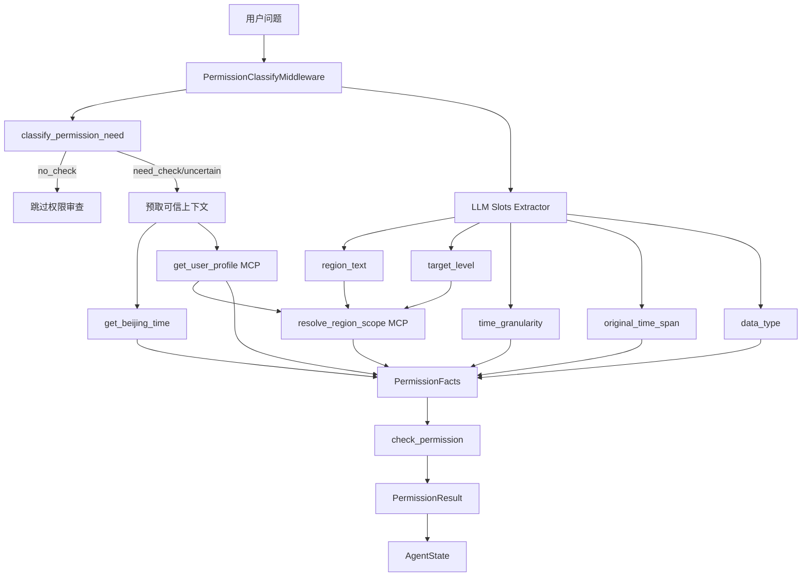

## 总体设计

本变更采用“事实抽取层 + 可信上下文层 + 确定性规则引擎层”的三层设计。



核心原则：

1. LLM 只允许输出 `PermissionExtractedSlots`，不得输出 `PermissionResult`。
2. MCP 工具只负责提供可信事实，不负责最终权限判定。
3. 代码规则引擎是 `PermissionResult` 的唯一生产者。
4. 所有权限规则必须可单测、可解释、可复现。

## 关键决策

### D1：不引入外部规则引擎库

**选择**：使用 Python 纯函数 + Pydantic 模型 + 配置表实现轻量规则引擎。

**理由**：当前规则属于固定决策链，不是海量可运营配置规则。通用规则库会增加学习成本、调试成本和依赖风险，不能显著提升可维护性。

**替代方案**：

- `durable_rules`：偏事件流/Rete 网络，过重。
- `business-rules`：适合运营条件配置，不擅长日期区间和行政区矩阵。
- `rule-engine`：表达式过滤能力强，但无法自然表达修正策略优先级。

### D2：LLM 输出 slots，不输出 PermissionResult

**选择**：新增 `PermissionExtractedSlots`，作为 LLM 结构化输出格式。

字段建议：

```python
class PermissionExtractedSlots(BaseModel):
    """权限审查前的语义抽取结果。"""

    region_text: str | None = None
    target_level: str | None = None
    time_granularity: str = "other"
    original_time_span: list[str] | None = None
    data_type: str = "region"
    metric_names: list[str] = []
```

LLM 禁止输出：

- `permitted`
- `fix_strategy`
- `allowed_region`
- `legal_time_span`
- `exemption`
- `correction_text`

这些字段必须由规则引擎生成。

### D3：两个 MCP 工具继续保留

`get_user_profile` 和 `resolve_region_scope` 是新方案的可信事实来源。

#### get_user_profile

由中间件在拿到 `user_id` 后主动调用。规则引擎依赖其中的：

- `bound_region.level`
- `bound_region.code`
- `bound_region.name`
- `city.code/name`
- `province.code/name`
- `frequent_regions`

#### resolve_region_scope

由中间件在拿到 `region_text` 后主动调用。调用入参优先使用：

- `query = slots.region_text`
- `contextCityCode = user_profile.city.code`
- `contextProvinceCode = user_profile.province.code`
- `targetLevel = slots.target_level`

不推荐直接把完整用户问题传入 `query`，除非 slots 抽取失败且处于兜底路径。

### D4：PermissionFacts 是规则引擎唯一输入

建议模型：

```python
class PermissionFacts(BaseModel):
    """权限规则引擎输入事实。"""

    question: str
    user_id: str
    beijing_time: str
    user_profile: dict[str, Any]
    requested_region: dict[str, Any] | None = None
    original_time_span: list[str] | None = None
    time_granularity: TimeGranularity = "other"
    data_type: str = "region"
    extraction_confidence: float | None = None
```

设计要求：

1. `PermissionFacts` 不包含判定结果。
2. `PermissionFacts` 允许记录 slots 置信度，但规则结果不应由置信度直接决定。
3. 所有 dict 输入在构造模型时做基础校验和归一化。

### D5：规则执行顺序固定

`check_permission()` 必须按以下顺序执行：

1. 校验用户画像是否可用。
2. 校验行政区解析结果是否可用、是否 ambiguous。
3. 判断是否命中适用范围排除项。
4. 计算当前粒度对应的豁免窗口。
5. 判断原始时间范围与豁免窗口关系。
6. 完全命中豁免窗口：直接放行。
7. 部分命中豁免窗口：优先截断时间。
8. 无时间豁免：执行基础行政区权限判断。
9. 行政区权限通过：直接放行。
10. 行政区权限不通过：生成替代行政区。
11. 无可用替代：硬拒绝。

该顺序不可由 LLM 或调用方调整。

### D6：修正策略优先级固定

修正策略优先级为：

```text
truncate_time > replace_region > reject
```

典型场景：区县用户查询近 30 天全国/省级数据。虽然行政区越权，但最近 7 天有部分豁免，因此必须先截断到最近 7 天，而不是替换行政区。

### D7：PermissionResult 继续作为跨流程协议

保留现有 `PermissionResult` 字段，不做破坏性变更。可选增加以下字段：

```python
matched_rules: list[str] = []
debug_context: dict[str, Any] | None = None
```

这些字段只用于日志、测试和排障，不应暴露给最终用户。

### D8：降级策略分级

P0 默认策略：

| 场景 | 处理 |
|---|---|
| `permission_need=no_check` | 跳过权限审查 |
| `user_id` 缺失 | 维持当前宽松降级为 no_check，并记录 warning |
| `get_user_profile` 未命中 | 返回硬拒绝或配置化降级，P0 默认硬拒绝更安全 |
| slots 抽取失败 | 降级为基础行政区权限；无法解析行政区时使用用户默认区域 |
| `resolve_region_scope` 未命中 | 无法确认请求行政区，默认按用户绑定区域执行或提示补充行政区 |
| `resolve_region_scope` ambiguous | 优先使用用户画像上下文消歧；仍 ambiguous 时提示补充行政区 |
| 规则引擎异常 | 记录 error，返回硬拒绝或配置化降级；权限安全逻辑不应静默放行 |

需要通过配置常量显式表达：

```python
PERMISSION_FAIL_CLOSED = True
```

若业务要求兼容当前宽松行为，可在灰度期设置为 `False`。

## 模块设计

### 1. `permission_slots.py`

职责：定义 LLM 抽取结果模型和提示词。

建议内容：

- `PermissionExtractedSlots`
- `PERMISSION_SLOT_EXTRACTION_PROMPT`
- `normalize_time_granularity()`
- `normalize_target_level()`

### 2. `permission_facts.py`

职责：定义规则引擎输入事实模型。

建议内容：

- `TimeGranularity` Literal
- `RegionLevel` Literal
- `PermissionFacts`
- `build_permission_facts()` 可选辅助函数

### 3. `permission_time.py`

职责：承载时间相关确定性逻辑。

可从 `permission_region.py` 迁移：

- `calculate_exemption_window()`
- `calculate_time_intersection()`
- `truncate_time_span()`
- `is_scope_excluded()`
- `_parse_date_str()`

迁移后 `permission_region.py` 只保留行政区逻辑。

### 4. `permission_engine.py`

职责：唯一权限判定入口。

建议公开函数：

```python
def check_permission(facts: PermissionFacts) -> PermissionResult:
    """执行确定性权限审查。"""
```

建议私有函数：

- `_reject()`
- `_allow()`
- `_build_time_truncation_result()`
- `_build_region_replacement_result()`
- `_extract_requested_region()`
- `_build_time_correction_text()`
- `_build_region_correction_text()`
- `_parse_beijing_time()`

### 5. `permission_classify_middleware.py`

职责：编排预分类、MCP 预取、slots 抽取、规则引擎调用和状态注入。

新的 `abefore_agent` 流程：

```text
1. 提取 user_id
2. 提取 latest_question
3. classify_permission_need(question)
4. no_check 快速返回
5. ensure_mcp_tools()
6. get_beijing_time
7. get_user_profile(user_id)
8. 调用 slots extractor 获取 PermissionExtractedSlots
9. 如果 slots.region_text 存在，调用 resolve_region_scope
10. 构造 PermissionFacts
11. 调用 check_permission(facts)
12. 写入 permission_result
13. 根据 fix_strategy 写入 permission_query_overrides
```

`wrap_model_call` / `awrap_model_call` 可基本沿用当前逻辑。

## 规则设计

### 时间豁免窗口

| 粒度 | 豁免窗口 | 说明 |
|---|---|---|
| `hourly` | 最近 7 天，精确到秒 | 今日 + 前 6 天 |
| `daily_count` | 最近 7 天，精确到秒 | 累计日值按小时级边界 |
| `daily` | 最近 7 天，精确到天 | 今日 + 前 6 天 |
| `week` | 最近 7 天，精确到天 | 周查询按日期范围求交集 |
| `other` | 最近 7 天，精确到天 | 自定义时间段 |
| `month` | 当前月 + 上一自然月 | 近两月 |
| `month_count` | 当前月 + 上一自然月 | 近两月累计 |
| `year` | 当前年 + 上一自然年 | 近两年 |
| `year_count` | 当前年 + 上一自然年 | 近两年累计 |

### 时间交集结果

| 结果 | 含义 | 权限动作 |
|---|---|---|
| `full_window` | 原始时间完全在豁免窗口内 | 放行，不看行政区 |
| `partial` | 原始时间与豁免窗口有交集 | 截断时间，保留行政区 |
| `none` | 无交集 | 进入基础行政区权限 |

### 基础行政区权限

复用现有规则：

```python
ALLOWED_LEVELS = {
    "province": {"province", "city"},
    "city": {"province", "city", "district"},
    "district": {"city", "district"},
}
```

同时结合 `build_permission_region_context()` 判断同省、同市和推荐替代行政区。

### 行政区修正矩阵

沿用 `get_replacement_region()` 当前实现，规则引擎只负责在无时间豁免时调用。

## 测试策略

### 单元测试层级

1. `test_permission_facts.py`：模型校验、默认值、非法粒度归一化。
2. `test_permission_time.py`：窗口计算、交集、截断、排除项。
3. `test_permission_engine.py`：直接构造 facts，验证所有核心规则。
4. `test_permission_classify_middleware.py`：mock MCP 和 slots extractor，验证中间件状态写入。
5. `test_permission_slot_extraction.py`：mock LLM 结构化输出，验证不允许 PermissionResult 字段参与判定。

### 必测场景

- `full_window`：区县用户查昨天全国/省级数据，直接放行。
- `partial`：区县用户查近 30 天全国/省级数据，截断到最近 7 天。
- `none`：区县用户查 2024 年省级数据，替换为区县。
- 省级用户查本省区县，窗口外替换为所属地市。
- 省级用户查外省区县，窗口外替换为所属省份。
- 地市用户查同市区县，窗口外放行。
- 地市用户查本省其他市区县，窗口外替换为本市默认区县。
- 地市用户查外省城市，窗口外替换为本市。
- ambiguous 行政区解析提示补充上下文或走安全降级。
- 用户画像未命中按 fail-closed 返回拒绝。

### 回归测试来源

以 `docs/权限豁免测试用例-自然语言问题集.md` 的 85 条用例为回归基准。P0 不要求全部端到端自动化，但至少要将其中核心权限矩阵转为 `PermissionFacts` 单测。

## 迁移策略

### 阶段 1：旁路实现规则引擎

新增模型和规则引擎，不改中间件主路径。通过单元测试验证 `check_permission()`。

### 阶段 2：中间件灰度双跑

中间件仍调用旧权限 Agent，同时旁路构造 facts 并调用规则引擎，日志记录两者差异，不影响线上结果。

### 阶段 3：切换主判定来源

将 `permission_result` 来源从旧权限 Agent 切换为 `check_permission()`，LLM Agent 降级为 slots extractor。

### 阶段 4：删除旧权限判定 Agent

删除或停用 `PERMISSION_CHECK_SYSTEM_PROMPT` 中的权限判定步骤，保留 slots 抽取提示词。移除 `CodeInterpreterMiddleware` 依赖于权限 Agent 的使用。

### 阶段 5：收敛测试和文档

补齐单测、更新 OpenSpec、更新 docs 中方案描述。

## 风险与缓解

| 风险 | 缓解 |
|---|---|
| LLM slots 抽错时间范围 | 单测覆盖常见表达；后续逐步规则化时间抽取 |
| 行政区文本抽取失败 | 可退化为完整问题调用 `resolve_region_scope`，但需记录低置信日志 |
| 后端 MCP 返回字段不稳定 | `PermissionFacts` 构造时做 normalize 和错误码处理 |
| fail-closed 影响体验 | 灰度期可配置 fail-open，但必须记录审计日志 |
| 与现有 prompt 注入冲突 | 保留现有 `<permission_context>` 协议，减少主流程改造 |
| 规则和文档不一致 | 每个规则变更必须同步单测和 OpenSpec |

## 回滚策略

保留旧权限 Agent 构造逻辑一个版本周期，通过配置切换：

```python
USE_DETERMINISTIC_PERMISSION_ENGINE = True
```

如发现规则引擎严重问题，可临时切回旧 Agent 路径；但需要记录原因并补充对应单测后再恢复。
